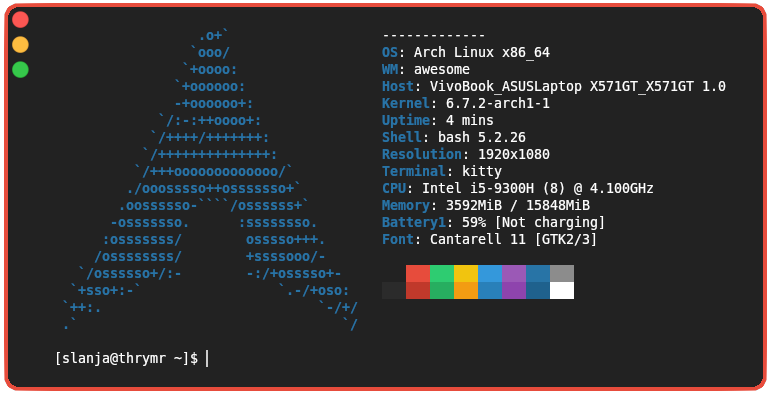

# Let's see how is my machine configured

## Eww bar

  - workspace indicator
  - battery capacity indicator
  - date and time

| Battery levels  |           |
|       ---       |    ---    |
| Green: #27ae60  | 100% - 50%| 
| Yellow: #f39c12 | 50% - 20% |   
| Red: #c0392b    | 20% - 0%  |  
